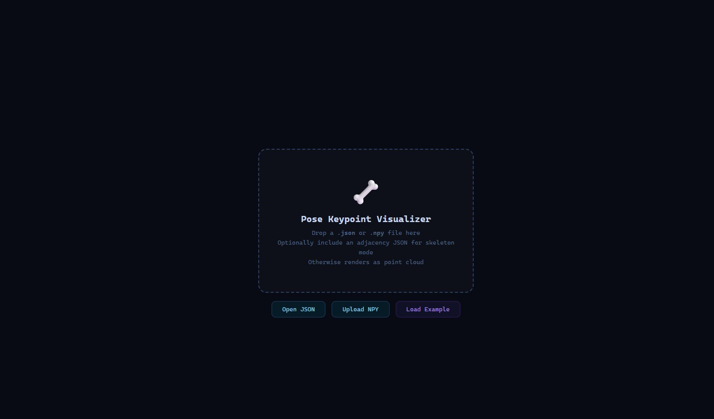
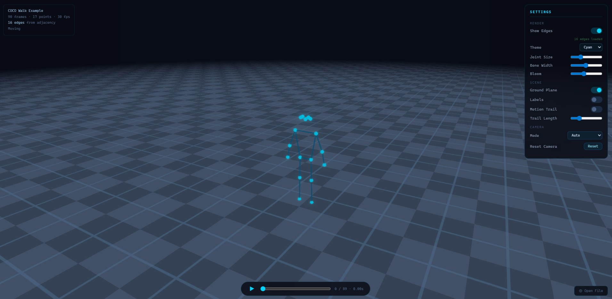

# Pose Keypoint Visualizer

A visually rich 3D viewer for human and animal pose keypoints, built with Three.js and Python.

---

## Features

- **Always a point cloud**: keypoints are rendered as 3D points every time
- **Edges via adjacency matrix**: provide an adjacency list and the viewer draws connections between specified point pairs (skeleton emerges from this)
- **No adjacency? No problem**: renders as a pure floating point cloud
- **Drag & drop** `.json` or `.npy` files directly onto the browser
- **Animated playback**: scrub timeline, play/pause, step frame-by-frame
- **Checkerboard ground plane**: infinite GLSL shader-based grid, fades at horizon
- **Camera auto-mode**: stationary poses → free orbit, moving poses → follows root joint
- **Motion trails**: ghost of previous N frames per joint
- **Post-processing**: ACES tonemapping + Unreal Bloom
- **Themes**: Cyan, Amber, Neon, Warm
- **Joint labels**: render joint names as overlays
- **Python converter**: turn any `.npy` file into the visualizer JSON format

**Requirements:** Node.js ≥ 18, Python ≥ 3.9 (only needed for `.npy` files)

---

## Preview

| Start Page | Example Points |
|---|---|
|  |  |

▶ [Watch demo](docs/demo.mp4)

---

## Quick Start

### 1. Install dependencies

**Node.js (viewer):**
```bash
cd viewer
npm install
```

**Python (converter + server):**
```bash
pip install -r requirements.txt
```

### 2. Load a JSON file (no server needed)

```bash
cd viewer
npm run dev       # opens http://localhost:5173
```

Drag any `.json` pose file onto the browser window, or click **Open JSON**.

### 3. Load an NPY file (requires Python server)

```bash
# Terminal 1 — Python server (handles NPY → JSON conversion)
python server/serve.py

# Terminal 2 — Vite dev server (optional, for live reload)
cd viewer && npm run dev
```

Open `http://localhost:8000` and drag your `.npy` file onto the page.

---

## Converting your data

```bash
# .npy with skeleton
python convert.py path/to/keypoints.npy \
  --adj examples/adjacency_coco17.json \
  --fps 30 \
  --out output.json

# .npy as point cloud (no adjacency)
python convert.py path/to/keypoints.npy --out output.json

# Validate / normalise an existing JSON
python convert.py existing.json --out normalised.json
```

### Expected `.npy` shapes

| Shape | Meaning |
|---|---|
| `(N, 3)` | Single frame, N joints, XYZ |
| `(N, 2)` | Single frame, N joints, XY (Z padded to 0) |
| `(T, N, 3)` | T frames, N joints, XYZ |
| `(T, N, 2)` | T frames, N joints, XY |

---

## JSON format

```jsonc
{
  "schema_version": "1.0",
  "name": "my_sequence",
  "fps": 30,
  "frames": 90,
  "joints": 17,
  "keypoints": [           // shape: [T, N, 3]
    [[x, y, z], ...],      // frame 0
    ...
  ],
  "adjacency": [           // optional — omit for point cloud mode
    [0, 1], [1, 2], ...    // list of [joint_i, joint_j] pairs
  ],
  "labels": ["nose", ...], // optional — one string per joint
  "meta": {                // auto-computed by convert.py
    "bbox_min": [x, y, z],
    "bbox_max": [x, y, z],
    "is_stationary": false,
    "root_std": 0.42
  }
}
```

---

## Adjacency files

Two formats are accepted — the converter auto-detects which one you provide:

**NxN binary matrix** (standard in GNN / pose estimation literature):
```json
[[0,1,0],[1,0,1],[0,1,0]]
```

**Edge list** (sparse, easier to write by hand):
```json
[[0,1],[1,2]]
```

Both can be wrapped in a dict: `{"edges": [...]}`, `{"adjacency": [...]}`, or `{"matrix": [...]}`.

Pre-built adjacency files are in `examples/`:

| File | Description |
|---|---|
| `adjacency_coco17.json` | COCO 17-joint human skeleton |
| `adjacency_macaque.json` | Macaque 17-joint skeleton |

---

## Generating example data

```bash
python examples/generate_examples.py
```

This creates `.npy` files and converts them to `.json` in one step.

Pre-converted JSON files are already included in `examples/` — drag them straight into the browser:

| File | Description |
|---|---|
| `examples/coco_walk.json` | 90-frame COCO walking cycle, 17 joints |
| `examples/tpose_static.json` | Single T-pose frame, 17 joints |
| `examples/point_cloud_sphere.json` | 60-frame animated point cloud, 64 points, no adjacency |

---

## Keyboard shortcuts

| Key | Action |
|---|---|
| `Space` | Play / Pause |
| `←` / `→` | Step one frame |
| `G` | Toggle ground plane |
| `L` | Toggle labels |
| `T` | Toggle motion trail |
| `R` | Reset camera |

---

## Production build

```bash
cd viewer
npm run build     # outputs to viewer/dist/

# Serve with Python (no Node required)
python server/serve.py
# → http://localhost:8000
```

---

## Project structure

```
pose-keypoint-visualizer/
├── convert.py               CLI converter (.npy / .json → visualizer JSON)
├── requirements.txt
├── server/
│   └── serve.py             FastAPI dev server + /convert endpoint
├── viewer/
│   ├── index.html           Single-page app shell
│   ├── vite.config.js
│   ├── package.json
│   ├── src/
│   │   ├── main.js          Three.js scene, renderer, animation loop
│   │   ├── skeleton.js      Joint/bone/cloud/trail rendering
│   │   ├── ground.js        Checkerboard shader plane
│   │   ├── camera.js        Auto-fit + follow-root camera
│   │   ├── loader.js        JSON/NPY loading + built-in example
│   │   └── ui.js            Panel, playback, drag-drop, keyboard
│   └── shaders/
│       ├── ground.vert
│       └── ground.frag
└── examples/
    ├── generate_examples.py
    ├── adjacency_coco17.json
    └── adjacency_macaque.json
```

---

## License

MIT
